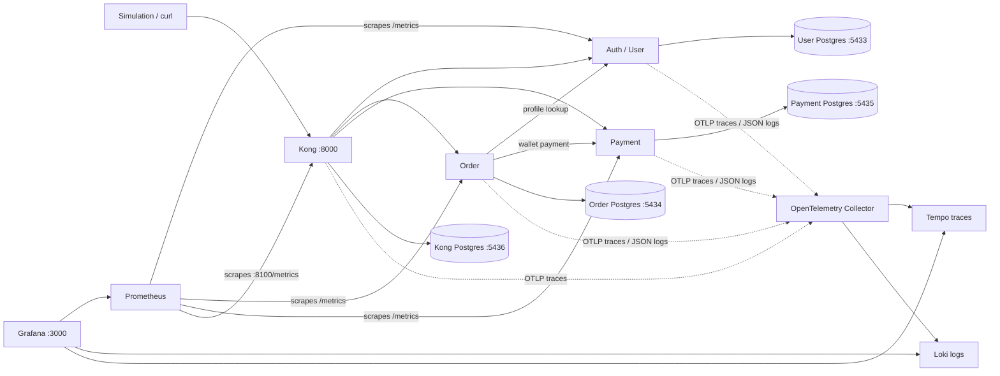

# Observability sharing-session demo

A local Go/Fiber microservice checkout with Kong, separate PostgreSQL databases, OpenTelemetry Collector, Tempo, Loki, Prometheus, and Grafana.

## Start and demonstrate

Requirements: Docker with Compose, Python 3, and roughly 6 GB available to Docker. On this Mac, Colima and the Docker CLI are installed. Start Colima after a reboot with `colima start --cpu 4 --memory 6 --disk 40`.

```sh
./scripts/start.sh
```

This builds and starts the stack, configures Kong, runs three rounds of simulation, and verifies the telemetry backends. Initial startup requires internet access to download images and Go modules. Later runs reuse the persistent databases and create fresh demo users.

Open **http://localhost:3000/d/order-observability**. Login: **admin / demo-observability**.

Generate fresh traffic while presenting:

```sh
python3 scripts/simulate.py --rounds 30
python3 scripts/verify-observability.py
```

The scripts deliberately produce successful requests, slow requests, and errors. An expected error is a passing scenario. `artifacts/simulation.json` contains the trace IDs and responses; `artifacts/verification.json` records backend verification.

## Architecture



Each service owns its database; services communicate over HTTP rather than reading each other's tables. Redis remains available for the existing service repository/cache interfaces; checkout uses synchronous HTTP and does not depend on a Redis event consumer.

The gateway creates or propagates W3C trace context. The order service propagates it to user and payment requests using OpenTelemetry's HTTP transport. Fiber handlers pass that same context to GORM, producing database spans. Service request and business-event logs carry `trace_id` and `span_id`. The Collector tails JSON files from a shared volume and sends logs to Loki's native OTLP endpoint; trace batches go to Tempo. Prometheus scrapes application and Kong metrics directly. Histograms and counters attach trace exemplars; trace IDs are never metric labels.

## Checkout flow

1. Register and log in through Kong; obtain the new user ID.
2. Read the user profile and initialize the wallet; top up 100,000.
3. Create an order costing 25,000. Order reads the real user profile, persists the order, calls payment, and marks the order `paid`.
4. Create another 25,000 order with a 1,200 ms payment delay. Its trace exposes the payment bottleneck.
5. Attempt an order costing 999,999. Payment rejects insufficient funds; the order is marked `payment_failed`, and the checkout endpoint returns 500 for this demo.
6. Verify the wallet still holds 50,000 and both successful orders are persisted as `paid`. Negative payment amounts return 400; an unknown user fails without a mock fallback.

`payment_delay_ms` is bounded to 0–2,000 ms and only forwarded/applied with `DEMO_MODE=true`.

## Suggested 15-minute presentation

| Time | Show | Explain |
| --- | --- | --- |
| 0–3 min | Architecture and simulation output | Separate service ownership; one checkout crosses several processes |
| 3–6 min | Dashboard: request rate, 5xx rate, p95 latency | Metrics reveal when and where behavior changes |
| 6–10 min | Explore → Tempo; paste a `slow` trace ID from the artifact | Expand gateway → order → payment; the payment server span accounts for about 1.2 seconds |
| 10–13 min | Explore → Loki; filter an insufficient-funds trace | Follow the same ID across services and find `payment_failed` |
| 13–15 min | Successful trace and wallet assertions | Show DB spans and contrast successful and failed flows; explain why all three signals are useful |

In Grafana Explore, use Tempo's **Trace ID** query with the IDs printed by the simulation. In Loki, expand a JSON line and click **TraceID**. From a Tempo span, use the logs link. Prometheus exemplars can also link metrics to a sampled trace.

Useful queries:

```promql
sum by (service) (rate(demo_http_requests_total[1m]))
sum by (service) (rate(demo_http_requests_total{status=~"5.."}[1m]))
histogram_quantile(0.95, sum by (le, service) (rate(demo_http_request_duration_seconds_bucket[1m])))
up
```

```logql
{service_name="order-service"} | json
{service_name=~".+"} |= "PASTE_TRACE_ID"
{service_name="order-service"} | json | message="payment_failed"
```

Use a 15-minute time range with 5-second refresh. Run 30 simulation rounds to keep the rate panels populated; rates naturally fall to zero after traffic stops. Histograms estimate percentiles from buckets, while a trace shows an individual request's exact duration.

## Local endpoints and databases

| Component | URL / port |
| --- | --- |
| Swagger UI (API Docs) | http://localhost:8088 |
| Grafana | http://localhost:3000 |
| Kong public API | http://localhost:8000/api/v1 |
| Kong Admin API | http://localhost:8001 |
| Prometheus | http://localhost:9090 |
| Loki | http://localhost:3100 |
| Tempo | http://localhost:3200 |
| User / order / payment / Kong PostgreSQL | localhost:5433 / 5434 / 5435 / 5436 |

All PostgreSQL instances use database `demo`, user `demo`, password `demo`. These are local demo credentials. Ports bind to loopback. Go services are only exposed inside the Compose network.

Example DBeaver queries: `SELECT id, status, fare FROM orders ORDER BY id DESC;` in the order DB, and `SELECT * FROM wallets; SELECT * FROM transactions;` in the payment DB.

## Operations

This Mac uses `docker-compose`; `scripts/start.sh` also supports `docker compose`.

```sh
docker-compose ps
docker-compose logs --tail=100 order-service payment-service otel-collector
# Stop containers, retain databases and telemetry:
docker-compose down
# Resume, configure, simulate and verify:
./scripts/start.sh
```

Do not use `down -v` unless you intend to erase all demo databases and telemetry. The root `compose.yaml` is canonical. `api-gateway/docker-compose.yml` includes it for compatibility. The reference `api-gateway/kong.yml` describes the routes; `scripts/configure-gateway.py` applies the actual configuration to Kong's persistent database.

## Scope and limitations

This is an observability workshop, not production payment/authentication software. The existing login returns a mock token, and endpoints do not enforce authorization. No real money is involved. Amounts retain the existing float/decimal model. Checkout is not an atomic transaction across databases: on a transport error an order becomes `payment_unknown`, with no automatic retry, because the payment may have succeeded. A production implementation needs idempotency, reconciliation, stronger authentication, exact currency handling, and an outbox/saga strategy. Do not automatically retry checkout.

Every trace is sampled for the demo. Log files are not rotated and Collector file offsets are not persisted, so restarting the Collector can replay logs. Startup diagnostics remain in container stdout; Loki receives structured request/business logs from the three Go services. Tempo retains traces for 24 hours. This single-node local stack uses demo credentials and pinned image versions for reproducibility, not a production hardening baseline.

## Implementation references

- [Kong OpenTelemetry plugin](https://developer.konghq.com/plugins/opentelemetry/)
- [Loki native OpenTelemetry ingestion](https://grafana.com/docs/loki/latest/send-data/otel/otel-collector-getting-started/)
